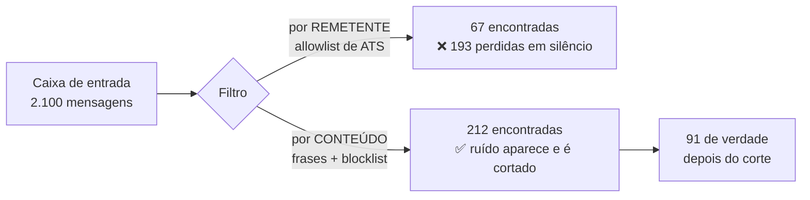
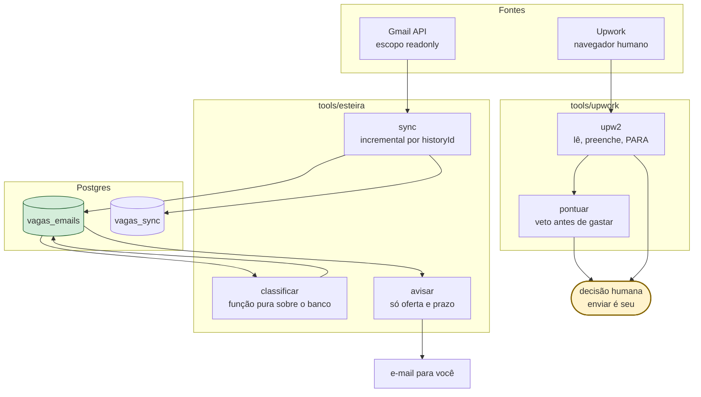
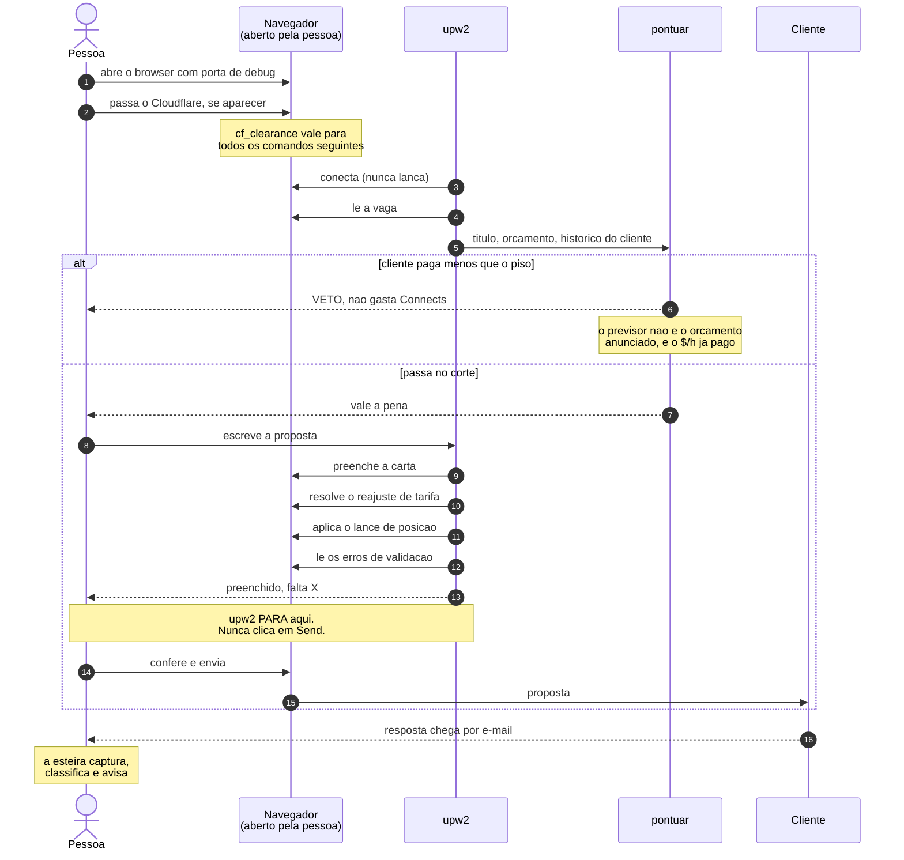
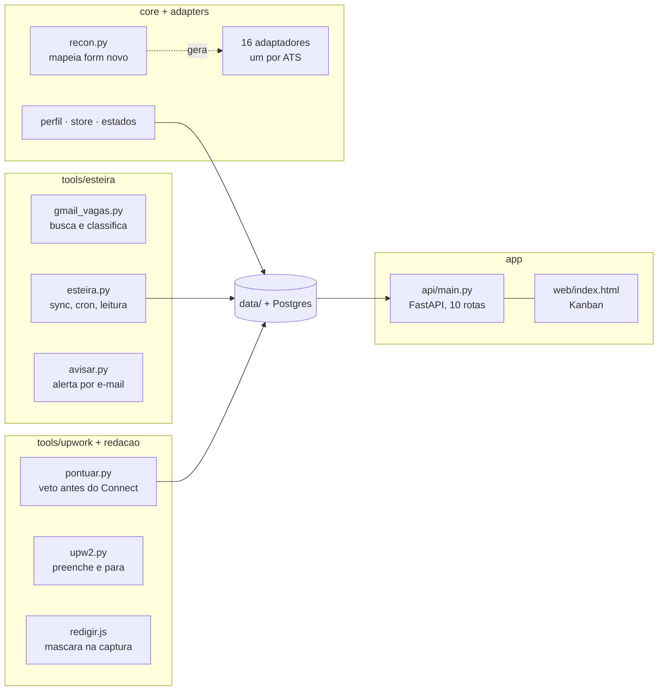
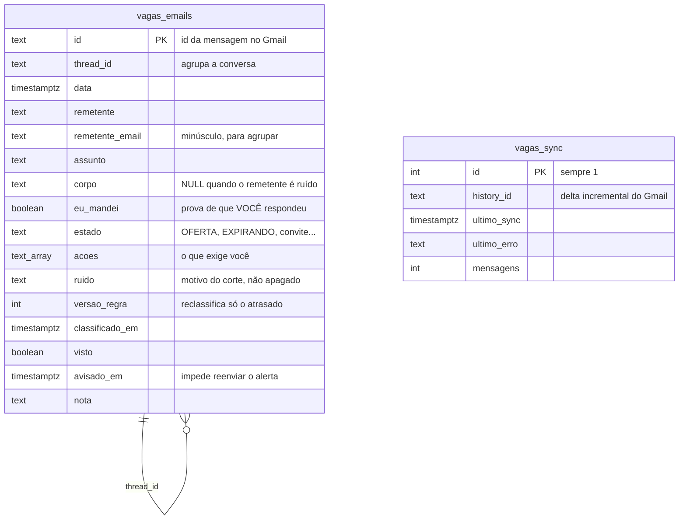
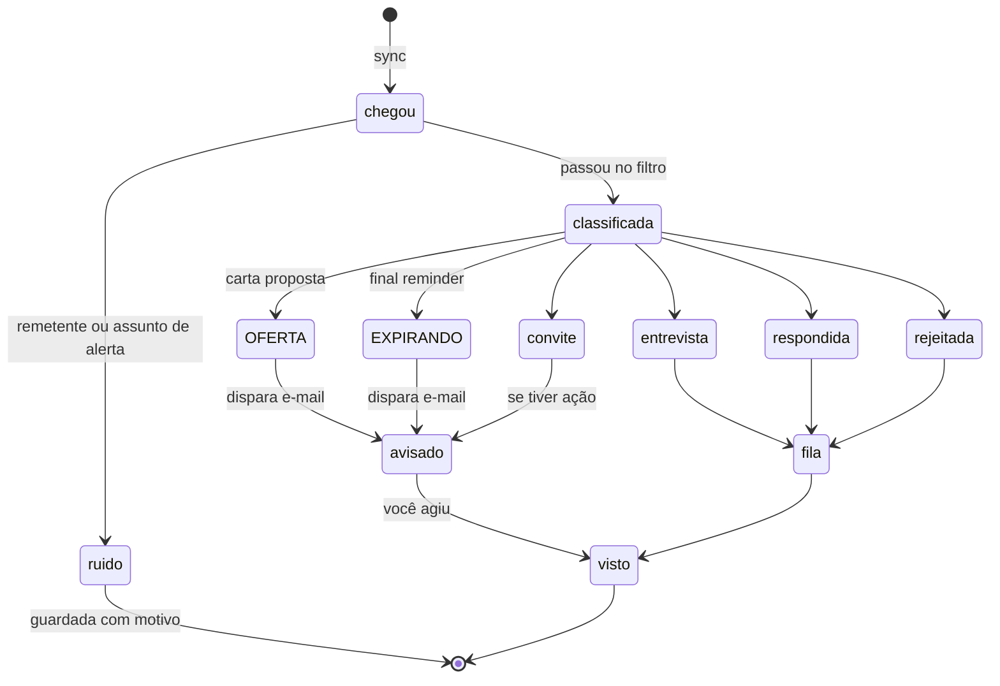

# esteira-vagas

[](https://github.com/MatheusEdson/esteira-vaga/actions/workflows/ci.yml)

Ferramentas para conduzir uma busca de emprego como se conduz uma operação: com dado
guardado, sinal separado de ruído, e decisão registrada.

Quatro partes independentes. Cada uma resolve um problema que aparece quando a busca deixa
de ser "mandei uns currículos" e vira volume.

| Parte | Problema | Solução |
|---|---|---|
| **Esteira de e-mail** | 2.100 mensagens em 45 dias, 91 relevantes | Busca por conteúdo, banco, alerta |
| **Candidatura** | Cada formulário quebra de um jeito diferente | 16 adaptadores + Kanban com API |
| **Upwork** | Formulário que falha em silêncio, vaga que não paga | Navegador atrelado, pontuação, preenchimento |
| **Redação de tela** | Print de portfólio vaza nome de cliente | Máscara ao vivo antes da captura |

📖 **[Guia de uso completo →](docs/GUIA.md)**
🪤 **[Gotchas de ATS →](docs/ats-gotchas.md)**

---

## Por que existe

Uma medição real, numa caixa de e-mail de quem estava procurando vaga:

```
2.100 mensagens em 45 dias
   67 encontradas filtrando por REMETENTE de plataforma
  212 encontradas filtrando por CONTEÚDO
  193 dessas 212 eram invisíveis ao filtro de remetente
   19 apareciam nos dois
   48 só o filtro de remetente achava
```

Os dois números importam. O filtro por conteúdo achou **193 que o outro perdia**, e o
filtro por remetente ainda pegava **48 que o de conteúdo não pegava** — mensagem curta,
sem frase reconhecível, que só se identifica pelo domínio de quem mandou. Por isso o
código roda os dois em OR: `gmail_vagas.py` mantém uma lista de 37 domínios de ATS como
segunda rede, e nenhum dos dois filtros é a resposta sozinho.

Entre as invisíveis: uma **carta proposta assinada**, um **convite de entrevista em vídeo
com prazo vencendo**, e um **"final reminder"** de uma vaga. Todos na caixa. Nenhum visto.

A causa foi um caractere. A lista de ATS conhecidos dizia `greenhouse.io`, e o Greenhouse
envia de `greenhouse-mail.io`. Um dos maiores ATS do mundo, invisível.

---

## A decisão de arquitetura

**Lista de permitidos falha invisível. Lista de bloqueados falha visível.**

Se o remetente que te respondeu não está na sua lista, ele não existe e você nunca descobre.
Se o ruído que falta na lista aparece na tela, você vê e corta. Perder uma entrevista custa
mais do que ler um assunto de newsletter.



**E armazenar antes de classificar.** Se busca e classificação são a mesma passada, melhorar
uma regra exige rebaixar tudo, e o que passou batido fica perdido. Com o e-mail no banco,
classificar vira função pura sobre dado local: custo zero, nada se perde.

---

## Arquitetura



**Nada aqui aperta enviar.** As ferramentas leem, organizam e preenchem. Isso não é
limitação técnica: o custo de um envio errado é maior que o ganho de automatizar o clique.

---

## O processo de candidatura

Onde a ferramenta atua e onde a pessoa decide. A regra e' que a maquina faz o trabalho
reversivel, e o humano faz o irreversivel.



**Por que o humano aperta Send.** Preencher errado se corrige; enviar errado nao. Uma
proposta ruim gasta Connects, queima a vaga e fica no historico do cliente. O ganho de
automatizar o clique nao paga esse risco.

**Dois modos de navegação, e o motivo de existirem os dois.** `nav.abrir()` levanta uma
sessão persistente endurecida, para Upwork e LinkedIn, onde a detecção decide se você
entra. Formulário de ATS não desafia ninguém, e ali um `launch()` simples basta: sessão
persistente é cara e não compra nada. O que vale nos dois casos é `chromium_sandbox=True`,
e por isso ele é aplicado no `sync_playwright` que o `nav.py` reexporta, e não só dentro
de `abrir()`. O padrão do Playwright é `False`, o que injeta `--no-sandbox` e faz o
Chromium mostrar a tarja de sinalizador sem suporte, visível a olho nu.

**Por que o navegador e' aberto por uma pessoa.** Todo caminho em que a automacao lancava o
browser terminou em loop infinito de desafio da Cloudflare, mesmo com fork endurecido,
sandbox ligado e perfil envelhecido. O mesmo IP, na mesma conta, no mesmo minuto, passou de
primeira num browser aberto a mao. A variavel era quem abria o processo.

### As tres armadilhas do formulario, agora resolvidas em codigo

Cada uma faz o envio falhar em silencio, e a unica mensagem e' "Please fix the errors below".

| Armadilha | O que acontece | Onde esta resolvida |
|---|---|---|
| "Schedule a rate increase" e' **obrigatorio** apesar de dizer *optional* | Send nao faz nada | `resolver_reajuste()` |
| O lance de posicao tem botao **"Set bid"** separado | Digitar o numero nao aplica | `confirmar_lance()` |
| Setter nativo de JS nao aciona o framework deles em `input` | Campo parece cheio, form diz vazio | `preencher_texto()` |

E uma de metodo: **clique nao e' prova de envio.** Confirme na lista de propostas enviadas
ou na mudanca de URL. Duas vezes o clique "funcionou" e nada foi enviado.

---

## Mapa do repositório



| Pasta | O que é | Como se roda |
|---|---|---|
| `tools/esteira/` | Leitura de e-mail, classificação, alerta | `python tools/esteira/esteira.py cron` |
| `adapters/` | 16 scripts: 6 por ATS, 10 por empresa | `python adapters/aplicar_<ats>.py` (sem `--submit` é dry-run) |
| `nav.py` | Camada de navegação: sessão endurecida e o sandbox padrão | importado por todo adaptador |
| `core/` | `bootstrap.py` (o que todo adaptador importa), perfil, estados, armazenamento, `recon.py` | importado, ou `python core/recon.py <url>` |
| `app/` | API FastAPI + Kanban das candidaturas | `uvicorn app.api.main:app` |
| `tools/upwork/` | Pontuação de vaga e preenchimento de proposta | `python tools/upwork/pontuar.py <dataset>` |
| `tools/redacao/` | Máscara de tela para gravar demo sem vazar cliente | cola no Console antes de gravar |
| `tests/` | 48 testes: classificação, caminhos, armazenamento, pontuação | `python -m pytest tests/ -q` |
| `deploy/` | Docker, nginx, e a regra de agendamento | ver `deploy/crontab.example` |
| `.githooks/` | Bloqueia credencial, CPF e telefone no commit | `git config core.hooksPath .githooks` |

### Por que 16 adaptadores e não um genérico

Foi tentado o genérico primeiro. Não sobrevive, e cada motivo está escrito no adaptador
que o encontrou, com a data:

- **inHire** põe máscara de moeda no campo de salário: `fill('15000')` vira `R$ 15,00`
  (`aplicar_inhire.py`).
- **LinkedIn Easy Apply** recusa `Cidade, UF, Brasil` com *Please enter a valid answer* e
  aceita `Cidade, Brazil` (`aplicar_easyapply.py`).
- **Greenhouse** casa pergunta por texto visível, não por `name`, então o mesmo campo muda
  de identificador entre vagas (`aplicar_greenhouse.py`).
- **Ashby** monta o campo depois do JS, e por cima **rejeita envio automatizado**: 5 de 5
  tentativas. O adaptador existe para preencher e parar, não para enviar
  (`docs/ats-gotchas.md`).

Dos 16, **6 são por ATS** (Ashby, Easy Apply, GeekHunter, Greenhouse, inHire, Teamtailor)
e **10 são por empresa**, porque a empresa usa formulário próprio. Dois são becos sem
saída conhecidos, mantidos porque mapear o formulário ainda vale.

`core/recon.py` é o que torna isso barato: aponta para um formulário desconhecido e ele
devolve o mapa dos campos, com id, rótulo e tipo. O adaptador novo sai desse mapa.

**Nenhum valor pessoal fica no código.** Pretensão, salário anterior, empregador atual,
cidade: tudo vem de `data/perfil.json`, que é gitignored. Campo vazio **aborta** o
adaptador em vez de inventar resposta, e isso é de propósito.

### O que todo adaptador importa

```python
import sys, os
sys.path.insert(0, os.path.dirname(os.path.dirname(os.path.abspath(__file__))))
from core.bootstrap import PERFIL, ID, do_perfil, cv, anexo, bloco, tmp, sync_playwright
```

Antes, esse cabeçalho tinha ~18 linhas repetidas nos 16 adaptadores, com um `do_perfil()`
idêntico em sete deles. Deu 26% de duplicação medida, e o custo não foi estético: quando o
caminho do perfil estava errado, **o mesmo bug precisou ser corrigido em 17 arquivos**. Um
lugar errado é um bug; dezessete lugares errados é uma política errada.

As duas primeiras linhas continuam ali porque o repositório não é um pacote instalável: os
adaptadores rodam como `python adapters/aplicar_x.py`. Empacotar resolveria, ao custo de
reestruturar vinte arquivos por um ganho que nenhum usuário sente.

### O teste que mais importa

`tests/test_adaptadores_carregam.py` importa cada adaptador com o navegador substituído por
um dublê e reprova em `NameError`, `TypeError`, `AttributeError` ou `ImportError`.

Ele existe porque os 16 adaptadores já ficaram **100% mortos** com `FileNotFoundError`
enquanto a suíte seguia verde: `compileall` passa, `pyflakes` passa, `pytest` passa, e nada
funciona, porque um caminho errado só falha quando alguém executa. Depois disso, a extração
do `bootstrap` quebrou cinco deles de novo com um erro de assinatura, que `pyflakes` também
não pega. Duas vezes o mesmo tipo de furo, agora fechado.

---

## Modelo de dados



Três decisões que valem explicar:

**`ruido` guarda o motivo, não apaga a linha.** Se a lista de bloqueio errar, dá para achar
e recuperar. Apagar é o erro que não tem volta.

**`versao_regra`** deixa reprocessar só o que ficou para trás quando você melhora uma regra.

**`avisado_em`** existe porque sem ela um cron de 15 minutos manda o mesmo alerta para
sempre, e em dois dias você filtra a própria ferramenta para o lixo.

---

## O ciclo de estados



A ordem em `REGRAS` **é** a prioridade: o primeiro que casa ganha. `OFERTA` vem primeiro
porque é o único e-mail que muda a vida de quem procura vaga. `EXPIRANDO` vem antes de
`entrevista` porque prazo vencendo vale mais que convite parado.

---

## Instalação

```bash
git clone https://github.com/MatheusEdson/esteira-vaga
cd esteira-vaga
python -m venv venv && . venv/bin/activate     # Windows: venv\Scripts\activate
pip install -r requirements.txt

cp .env.example .env                  # preencha DATABASE_URL e as chaves
cp perfil.example.json data/perfil.json   # preencha: SEM isto nada roda
git config core.hooksPath .githooks   # liga o bloqueio de segredo no commit

psql "$DATABASE_URL" -f tools/esteira/schema.sql
```

**Os três `cp` não são opcionais.** `data/perfil.json` é a única fonte de verdade sobre o
que pode ser afirmado num formulário, e campo vazio faz o adaptador **abortar** em vez de
inventar resposta. É de propósito.

Para os adaptadores, ainda: coloque seus currículos em `curriculos/`, anexos em `anexos/`
e as respostas dissertativas em `respostas/` — as três pastas são gitignored, e os nomes
dos arquivos saem do `data/perfil.json`. Eles usam o navegador pelo canal `msedge`, então
é preciso ter Edge ou Chrome instalado (ou mudar `VAGAS_CANAL`).

```bash
python tools/esteira/gmail_vagas.py autorizar   # uma vez
python tools/esteira/gmail_vagas.py tudo 7          # veja o padrão da SUA caixa
python tools/esteira/esteira.py sync
python tools/esteira/esteira.py classificar
python tools/esteira/esteira.py ler
```

Comece por `tudo 7`. Ele varre a caixa inteira dos últimos 7 dias e mostra quanto é ruído,
quanto é alerta e quanto é pipeline. É como este projeto começou.

---

## Segurança

- **Escopo `gmail.readonly`.** Não envia, não responde, não arquiva, não apaga.
- **Nenhuma credencial no código.** Tudo vem de variável de ambiente.
- **Nada pessoal versionado.** Currículo, resposta, print e dado de perfil estão no
  `.gitignore`.
- **O token do OAuth fica na máquina de quem roda.** Não passa por servidor nenhum.

⚠️ **App OAuth em publishing status "Testing" tem refresh token que expira em 7 dias.** Se
for rodar em cron, publique o app, senão ele morre em uma semana parecendo bug.

---

## Stack

Python 3.10+ · PostgreSQL · Gmail API · Playwright/patchright · FastAPI · Docker

## Licença

MIT. Veja [LICENSE](LICENSE).
